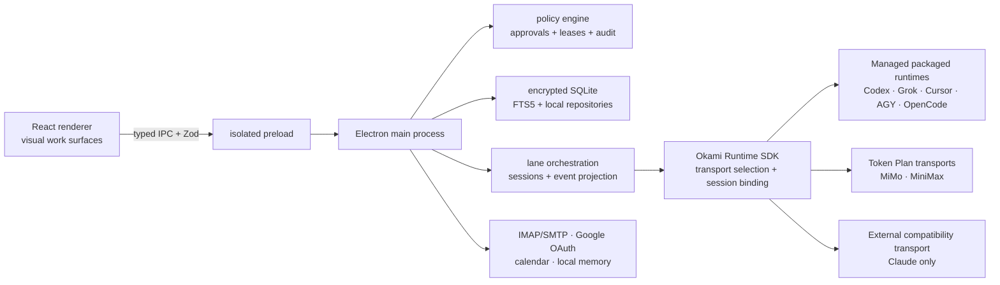

# OkamiCode

<p align="center">
  
</p>

<p align="center">
  A local-first desktop cockpit for coding agents, communication, planning, usage intelligence, and durable memory.
</p>

<p align="center">
  <strong>English</strong> · <a href="README.pt-BR.md">Português do Brasil</a>
</p>

> **Beta software.** OkamiCode `1.0.1-beta` is usable for local evaluation and active development, but provider parity, credential setup, quota collection, account connectors, and packaging still vary by transport and service.

## Why OkamiCode exists

Developers who already pay for several AI subscriptions should not need to keep five terminals and desktop apps open—or pay for a second API bill—just to use the right model for each job.

OkamiCode provides one visual workspace around an Okami-owned multi-provider runtime, documented provider APIs, and optional subscription-backed transports. A project stays attached to its folder, each session stays bound to the transport that created it, and switching models does not silently ask one paid agent to drive another paid agent.

The product also brings the rest of the workday into the same local cockpit: independent chat, multi-account email, calendars, Kanban tasks, usage and equivalent API-cost analysis, local memory, runtime diagnostics, Git changes, files, terminals, browser previews, and background activity.

## What's new in 1.0.1 Beta

- **Context that survives provider changes:** a shared conversation history, explicit task-state handoff, and deterministic compaction keep relevant context available without replaying the entire transcript to every model.
- **Safer local continuity:** automatic database backup and recovery, legacy application-data discovery, and Keychain identity compatibility protect projects, tasks, conversations, and credentials during upgrades.
- **A calmer Code workspace:** compact agent activity, expandable execution details, refined composer and workspace panels, stronger project colors, pinning, active-run motion, unread completion badges, and visible loading feedback.
- **OpenCode through ACP:** OpenCode joins the runtime catalog through its official ACP server while remaining one provider option—not the owner of every OkamiCode thread.
- **Runtime truth instead of optimistic guessing:** authoritative capability manifests, packaged binary discovery, conformance tests, lane-health signals, and explicit provider limitations.
- **Honest usage economics:** normalized provider telemetry, restored historical activity, and OpenRouter-equivalent cost tracking now emphasize observed spend while keeping monthly projection secondary.

Read the complete [1.0.1 Beta release notes](docs/releases/v1.0.1-beta.md) or the [PT-BR version](docs/releases/v1.0.1-beta.pt-BR.md).

## Highlights

### Code workspace

- Folder-bound projects with persistent provider lanes and native session continuity.
- Runtime and model selection directly in the composer.
- Structured rendering for Markdown, tool activity, approvals, errors, timing, and token telemetry.
- Integrated Git change list and diff viewer, file explorer, terminal, browser preview, and background-task surface.
- Explicit permission modes: OkamiCode does not silently grant an agent broader access.

### Independent chat

- Workspace-free conversations for research, writing, translation, and quick questions.
- Separate history so casual chat does not pollute a coding project.
- Optional context and memory attachment.
- Provider, model, effort, execution state, and response provenance remain visible.

### Unified inbox and calendar

- Multiple IMAP/SMTP accounts plus Google OAuth for Gmail.
- HTML email rendering with remote-image controls.
- Read/unread, spam, trash, reply, forward, aliases, bulk actions, AI analysis, draft review, and email-to-task workflows.
- Day, week, and month calendar views with local and linked sources.
- Event details extract meeting links, participants, timezone, location, and notes into scannable sections.

### Tasks and delegation

- Kanban workflow for manual and agent-owned tasks.
- A task stores its objective, instructions, source context, workspace, provider, model, and activation policy.
- Delegated email tasks remain attached to the source conversation and wake the assigned lane only when relevant state changes.

### Usage and subscription intelligence

- Native quota windows when a provider exposes reliable quota data.
- Input, cached-input, output, reasoning, and model-call activity recorded by provider and model when available.
- Equivalent API-cost estimates using OpenRouter price metadata and an explicit model mapping.
- Subscription-versus-API comparison with source, freshness, and coverage indicators.

> Cost values are estimates, not invoices. A missing native token counter remains unavailable; OkamiCode never fabricates zero usage.

### Local memory

- Encrypted local SQLite database with FTS5 full-text search.
- Explicit, read-only indexing of selected Markdown/Obsidian folders.
- File watching, provenance, bounded context injection, and sensitive-line redaction.
- Local GBrain installation/status detection. OkamiCode does not upload the indexed vault to a hosted memory service.

## Supported runtimes

| Runtime             | Transport                         | Entitlement                       |
| ------------------- | --------------------------------- | --------------------------------- |
| OpenAI / Codex      | packaged official app-server      | ChatGPT subscription OAuth/device |
| xAI / Grok          | packaged official agent           | Grok subscription OAuth/device    |
| Cursor Agent        | packaged Cursor Agent             | Cursor subscription login         |
| Antigravity (`agy`) | packaged native adapter           | Google AI subscription login      |
| OpenCode            | packaged ACP server               | OpenCode-selected account         |
| Xiaomi MiMo         | Okami Responses; no executable    | dedicated Token Plan key and URL  |
| MiniMax             | Okami Chat Completions; no binary | dedicated Token Plan key          |
| Claude Code         | external Claude CLI               | Anthropic subscription login      |

Settings shows both the active transport and its entitlement. Codex, Grok,
Cursor, Antigravity, and OpenCode resolve only versioned artifacts owned by the
OkamiCode application bundle or its user-data directory. MiMo and MiniMax
accept only Token Plan credentials in the encrypted vault and register no
executable. Claude is the sole transport allowed to resolve a host executable.
There is no automatic pay-as-you-go or global-binary fallback.

OpenCode is integrated through its official ACP server. BB is an architectural
reference for persistent, steerable threads and explicit handoff; it is not
embedded as a second orchestrator. See
[Runtime and harness boundary](docs/architecture/runtime-harness-boundary.md).

## Architecture



Provider output is normalized into canonical events for presentation and persistence. OkamiCode owns API streaming, context continuation, workspace tools, policy, approvals, cancellation, and usage normalization for its first-party transports. OpenRouter remains pricing metadata, not the default inference layer.

## Security and privacy model

- Local-first storage. Conversations, indexes, usage activity, and connector state live on the Mac.
- SQLite is encrypted with a key protected through Electron `safeStorage`.
- Renderer code has no direct Node.js access; privileged actions pass through validated IPC contracts.
- Capability leases, approval records, audit events, expiry, and resource matching gate agent actions.
- Connector secrets are stored outside the repository in the application user-data directory.
- Email HTML is sanitized; remote images are controlled separately.
- Memory indexing only reads explicitly selected roots and rejects path/symlink escape.
- Runtime diagnostics redact bearer tokens and credential-shaped values.

No security boundary is magic: an authenticated local agent can still modify files that you explicitly allow it to access. Review permissions and diffs before approving sensitive work.

## Requirements

- macOS on Apple Silicon for the packaged beta.
- Node.js `24.17.0` (see `.nvmrc`).
- pnpm `11.5.2` through Corepack.
- Xcode Command Line Tools for native Node modules.
- At least one authenticated subscription or configured Token Plan.

## Run from source

```bash
git clone https://github.com/OkamiOps/OkamiCode.git
cd OkamiCode
nvm use
corepack enable
pnpm install
pnpm rebuild:native
pnpm dev
```

The database and credentials are created under Electron's macOS application data directory. For isolated development or tests, set `OKAMI_USER_DATA_DIR` to a dedicated local path.

## Validation

```bash
pnpm typecheck
pnpm lint
pnpm format:check
pnpm test
pnpm test:e2e
pnpm check
```

`pnpm check` is the required repository gate. Packaging rebuilds native modules for Electron; if tests later report a `better-sqlite3-multiple-ciphers` ABI mismatch, rebuild that dependency for the active Node runtime before re-running the gate:

```bash
pnpm rebuild better-sqlite3-multiple-ciphers
pnpm check
```

## Package the macOS app

```bash
pnpm package
pnpm verify:managed-package release/mac-arm64/OkamiCode.app
```

The command produces both the unpacked application and the Apple Silicon installer:

- `release/mac-arm64/OkamiCode.app`
- `release/OkamiCode-v1.0.1-beta-macOS-arm64.dmg`

During `afterPack`, the build writes an exact managed-runtime trust manifest
inside the application. The verifier requires that inventory and compares its
expected SHA-256 with the observed Codex, Grok, Cursor, Antigravity, and
OpenCode payloads before probing a version. MiMo, MiniMax, and external Claude
must not carry an expected executable hash. Version probes use only
`--version`, `PATH=/usr/bin:/bin`, an isolated `HOME`, and no inherited
provider credentials. The JSON proof includes expected and observed checksums,
absolute sources, ownership, and the trust-manifest checksum. A missing,
modified, extra, or symlink-escaped artifact fails closed without a model turn.

Open the DMG, drag **OkamiCode** to **Applications**, and launch it from Applications. The `1.0.1-beta` artifact is unsigned and non-notarized, so macOS may require an explicit approval in **Privacy & Security**. Production signing and notarization are intentionally not claimed by this beta.

## Configuration notes

- **Google:** create a Google OAuth Desktop client and authorize Gmail/Calendar with Google's browser flow. OkamiCode does not ask for your normal Google password.
- **IMAP/SMTP:** authentication requirements are controlled by the email provider. Prefer OAuth or provider-specific app credentials when required.
- **OpenRouter:** used as pricing metadata for the equivalent-cost simulation, not as the default inference provider.
- **Memory:** select the exact Obsidian or Markdown folders to index; no folder is imported automatically.
- **Codex, Grok, Cursor, Antigravity, and OpenCode:** reuse their provider-owned configuration while OkamiCode owns the versioned executable path. Global installations are ignored.
- **MiMo and MiniMax:** enter only dedicated Token Plan credentials in Settings. Ordinary API keys are rejected and secrets never return to the renderer.
- **Claude:** the official host CLI is the only external executable exception.
- **Updates:** runtime and transport capabilities are detected independently. Re-scan after changing credentials or updating Claude.

## Beta limitations

- macOS Apple Silicon is the only packaged target in this release.
- Provider capabilities are not identical. Missing structured output, quota, token, or model data is shown as unavailable.
- OAuth credentials and calendar/email behavior still depend on provider configuration and account policy.
- MiniMax function tools are not yet implemented in the Okami Chat Completions transport.
- Equivalent API pricing can drift until the next OpenRouter metadata refresh.
- The beta is not signed or notarized and has not yet gone through a third-party security audit.

## Documentation

- [Changelog](CHANGELOG.md) · [PT-BR](CHANGELOG.pt-BR.md)
- [1.0.1 Beta release notes](docs/releases/v1.0.1-beta.md) · [PT-BR](docs/releases/v1.0.1-beta.pt-BR.md)
- [1.0.0 Beta release notes](docs/releases/v1.0.0-beta.1.md) · [PT-BR](docs/releases/v1.0.0-beta.1.pt-BR.md)
- [Product principles](PRODUCT.md)

## Project status

OkamiCode is under active development by OkamiOps. Issues should include the OkamiCode version, macOS version, provider/CLI version, the affected surface, and sanitized logs. Never post tokens, OAuth files, mailbox passwords, or private message content in a public issue.
