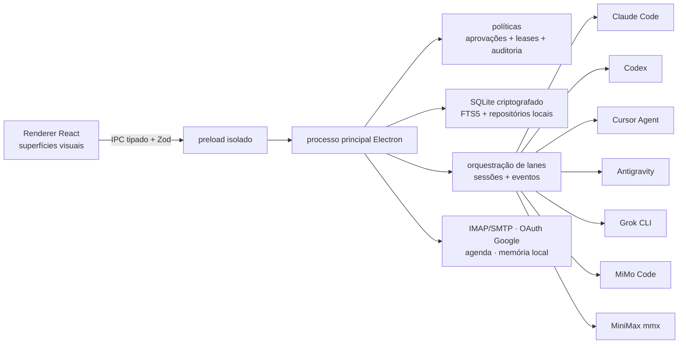

# OkamiCode

<p align="center">
  
</p>

<p align="center">
  Um cockpit desktop local-first para agentes de código, comunicação, planejamento, inteligência de uso e memória durável.
</p>

<p align="center">
  <a href="README.md">English (principal)</a> · <strong>Português do Brasil</strong>
</p>

> **Software beta.** O OkamiCode `1.0.0-beta.1` pode ser usado para avaliação local e desenvolvimento ativo, mas a paridade entre providers, coleta de cotas, conectores de conta e empacotamento ainda dependem do que cada CLI e serviço instalado expõe.

## Por que o OkamiCode existe

Quem já paga várias assinaturas de IA não deveria manter cinco terminais e aplicativos abertos — nem pagar uma segunda conta de API — só para usar o modelo certo em cada trabalho.

O OkamiCode oferece um único ambiente visual em volta dos CLIs e das assinaturas já disponíveis no Mac. Cada projeto permanece vinculado à sua pasta, cada provider preserva a própria sessão nativa e trocar de modelo não faz silenciosamente um agente pago controlar outro agente pago.

O restante do trabalho também entra no mesmo cockpit local: chat independente, múltiplas caixas de e-mail, agendas, tarefas Kanban, análise de uso e custo equivalente de API, memória local, diagnóstico dos runtimes, alterações Git, arquivos, terminais, navegador e processos em segundo plano.

## Principais recursos

### Code por workspace

- Projetos vinculados a pastas, com lanes persistentes por provider e continuidade da sessão nativa.
- Seleção de runtime e modelo diretamente no composer.
- Renderização estruturada de Markdown, atividades de ferramentas, aprovações, erros, duração e tokens.
- Alterações e diff do Git, explorador de arquivos, terminal, navegador e tarefas em segundo plano integrados.
- Modos explícitos de permissão: o OkamiCode não amplia o acesso de um agente silenciosamente.

### Chat independente

- Conversas sem workspace para pesquisa, escrita, tradução e perguntas rápidas.
- Histórico separado para não poluir projetos de desenvolvimento.
- Contexto e memória opcionais.
- Provider, modelo, effort, execução e origem da resposta continuam visíveis.

### Inbox e agenda unificados

- Várias contas IMAP/SMTP e OAuth oficial do Google para Gmail.
- Renderização de e-mail HTML com controle de imagens remotas.
- Lido/não lido, spam, lixeira, resposta, encaminhamento, aliases, ações em massa, análise com IA, revisão de rascunho e transformação de e-mail em tarefa.
- Agenda em dia, semana e mês, com fontes locais e conectadas.
- Detalhes de evento separam links de reunião, participantes, fuso horário, local e observações em blocos fáceis de ler.

### Tarefas e delegação

- Kanban para tarefas manuais ou assumidas por agentes.
- Cada tarefa guarda objetivo, diretriz, contexto de origem, workspace, provider, modelo e política de ativação.
- Tarefas delegadas a partir de e-mails continuam ligadas à conversa e só acordam a lane quando existe uma mudança relevante.

### Uso e retorno das assinaturas

- Janelas de cota nativas quando o provider fornece dados confiáveis.
- Entrada, cache de entrada, saída, reasoning e chamadas registrados por provider e modelo quando disponíveis.
- Simulação de custo equivalente de API usando preços do OpenRouter e um de/para explícito de modelos.
- Comparação assinatura versus API com fonte, frescor e cobertura.

> Os custos são estimativas, não faturas. Quando um CLI não fornece contador de tokens, o dado permanece indisponível; o OkamiCode não inventa uso zero.

### Memória local

- SQLite local criptografado com busca full-text FTS5.
- Indexação explícita e somente leitura de pastas Markdown/Obsidian selecionadas.
- Monitoramento de arquivos, proveniência, contexto limitado e remoção de linhas sensíveis.
- Detecção local da instalação e do estado do GBrain. O vault indexado não é enviado para uma memória hospedada.

## Runtimes suportados

| Runtime             | Adapter                  | Origem típica da conta | Observações                                                                |
| ------------------- | ------------------------ | ---------------------- | -------------------------------------------------------------------------- |
| Claude Code         | Nativo                   | Assinatura Anthropic   | Sessões, hooks, ferramentas, aprovações, uso e modelos quando expostos     |
| Codex               | App-server nativo        | Assinatura OpenAI      | Sessões, modelos, effort, aprovações, ferramentas, uso e background        |
| Cursor Agent        | Nativo                   | Assinatura Cursor      | Catálogo e stream estruturado dependem do CLI instalado                    |
| Antigravity (`agy`) | Nativo + companion local | Assinatura Google AI   | O companion de hooks é local; capacidades e cota dependem da versão        |
| Grok CLI            | Nativo                   | Assinatura xAI         | Sessões e saída estruturada quando suportadas pelo CLI                     |
| MiMo Code           | Nativo                   | Token Plan Xiaomi MiMo | Execução e modelos; a cota pode continuar disponível apenas no console web |
| MiniMax (`mmx`)     | Nativo                   | Token Plan MiniMax     | Texto, catálogo e janelas de uso quando expostos                           |

O OkamiCode não instala nem autentica esses CLIs. Instale cada CLI separadamente, use o login oficial e confira em **Configurações** o binário, a versão e as capacidades realmente detectadas.

## Arquitetura



A saída de cada provider é normalizada em eventos canônicos para apresentação e persistência. O modelo continua rodando pelo próprio CLI e harness nativo; a interface não substitui os runtimes por uma execução genérica via OpenRouter.

## Segurança e privacidade

- Armazenamento local-first. Conversas, índices, atividade e conectores ficam no Mac.
- SQLite criptografado com chave protegida pelo `safeStorage` do Electron.
- O renderer não acessa Node.js diretamente; ações privilegiadas usam contratos IPC validados.
- Leases de capacidade, aprovações, auditoria, expiração e correspondência de recursos limitam ações dos agentes.
- Segredos de conectores ficam fora do repositório, no diretório de dados do aplicativo.
- HTML de e-mail é sanitizado; imagens remotas têm controle separado.
- A memória só lê raízes explicitamente escolhidas e bloqueia escape por caminho ou symlink.
- Diagnósticos removem bearer tokens e valores com formato de credencial.

Nenhuma barreira é mágica: um agente autenticado localmente ainda pode alterar arquivos que você autorizou. Revise permissões e diffs antes de aprovar trabalhos sensíveis.

## Requisitos

- macOS Apple Silicon para o pacote beta.
- Node.js `24.17.0` (veja `.nvmrc`).
- pnpm `11.5.2` via Corepack.
- Xcode Command Line Tools para módulos nativos.
- Pelo menos um CLI de IA suportado, instalado e autenticado separadamente.

## Executar pelo código-fonte

```bash
git clone https://github.com/OkamiOps/OkamiCode.git
cd OkamiCode
nvm use
corepack enable
pnpm install
pnpm rebuild:native
pnpm dev
```

Banco e credenciais ficam no diretório de dados do Electron no macOS. Para desenvolvimento ou testes isolados, defina `OKAMI_USER_DATA_DIR` para uma pasta local exclusiva.

## Validação

```bash
pnpm typecheck
pnpm lint
pnpm format:check
pnpm test
pnpm test:e2e
pnpm check
```

`pnpm check` é o gate obrigatório. O empacotamento recompila módulos nativos para Electron; se os testes reportarem incompatibilidade de ABI do `better-sqlite3-multiple-ciphers`, recompile a dependência para o Node ativo:

```bash
pnpm rebuild better-sqlite3-multiple-ciphers
pnpm check
```

## Empacotar para macOS

```bash
pnpm package
open release/mac-arm64/OkamiCode.app
```

O artefato `1.0.0-beta.1` é Apple Silicon, não assinado e não notarizado. O macOS pode exigir aprovação em **Privacidade e Segurança**. Este beta não alega assinatura ou notarização de produção.

## Notas de configuração

- **Google:** crie um cliente OAuth do tipo Desktop e autorize Gmail/Agenda pelo navegador oficial. O OkamiCode não pede sua senha normal do Google.
- **IMAP/SMTP:** os requisitos são definidos pelo provedor. Prefira OAuth ou credencial específica de aplicativo quando exigida.
- **OpenRouter:** fornece metadados de preço para a simulação, não é o provider padrão de inferência.
- **Memória:** selecione exatamente as pastas Obsidian/Markdown; nenhuma pasta é importada automaticamente.
- **Atualizações:** capacidades vêm da versão instalada do CLI. Faça uma nova detecção depois de atualizar um CLI.

## Limitações do beta

- Apenas macOS Apple Silicon tem pacote nesta versão.
- As capacidades dos providers não são idênticas. Dados ausentes de saída estruturada, cota, tokens ou modelos aparecem como indisponíveis.
- OAuth e o comportamento de e-mail/agenda dependem da configuração e política da conta.
- A cota do MiMo não é exposta pelo CLI atual e pode aparecer apenas no console web oficial.
- O custo equivalente pode variar até a próxima atualização dos preços do OpenRouter.
- O beta não é assinado, não é notarizado e ainda não passou por auditoria de segurança independente.

## Documentação

- [Changelog em inglês](CHANGELOG.md) · [PT-BR](CHANGELOG.pt-BR.md)
- [Release 1.0 Beta em inglês](docs/releases/v1.0.0-beta.1.md) · [PT-BR](docs/releases/v1.0.0-beta.1.pt-BR.md)
- [Princípios do produto](PRODUCT.md)

## Estado do projeto

O OkamiCode está em desenvolvimento ativo pela OkamiOps. Issues devem informar versão do OkamiCode, versão do macOS, provider/CLI, área afetada e logs sanitizados. Nunca publique tokens, JSON OAuth, senhas de caixa ou conteúdo privado de mensagens em uma issue pública.
