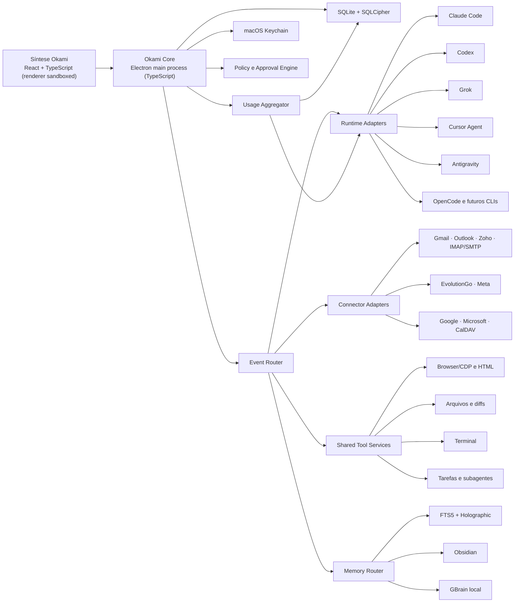

# Okami Workbench — especificação de produto e arquitetura

**Data:** 2026-07-17

**Status:** design e revisão documental aprovados; plano da Fase 1 preparado

**Revisão 2026-07-18:** estrutura de layout fixada pela referência visual do usuário (ver `2026-07-18-okami-workbench-layout-reference.md`), Todoist definido como provider inicial do Kanban e fases reordenadas para entregar Inbox, Kanban e Agenda antes do catálogo amplo de runtimes.

**Revisão 2026-07-18 (2):** shell desktop trocado de Tauri 2 + Rust para **Electron + TypeScript de ponta a ponta**, por decisão do usuário: todos os CLIs orquestrados são Node.js, e uma única linguagem acelera o desenvolvimento (executado pelo Codex, coordenado pelo Claude). Duas clarificações de leitura: (a) "Codex-Driven" descreve apenas quem escreve o código do app durante a construção, não o runtime do produto — o produto continua multi-runtime com Claude Code como harness preferencial; (b) `stream-json` é somente o formato estruturado de eventos do Claude Code CLI para integração programática, não um modo ou modelo diferente.

**Plataforma inicial:** macOS 26 em Apple Silicon

**Princípio central:** uma interface local para trabalhar, comunicar, organizar e delegar usando as assinaturas e os CLIs já instalados.

## 1. Resumo executivo

O Okami Workbench é uma aplicação desktop local-first que reúne:

- coding com Claude Code, Codex, Grok, Cursor, Antigravity e outros runtimes;
- troca explícita de modelo, provider, assinatura e harness;
- browser, HTML inline, arquivos, diffs, terminal, tarefas paralelas, subagentes e aprovações;
- múltiplas caixas de email, WhatsApp, calendários e Kanban;
- chat rápido global sem workspace obrigatório;
- painel unificado de uso, limites, resets, contexto e atividade local;
- delegação de emails, conversas, cards, eventos, PRs e trabalhos de desenvolvimento;
- memória compartilhada por SQLite FTS5, Holographic/HRR, Obsidian e GBrain local.

O produto não é um terminal com uma skin. A experiência principal é uma conversa legível, semelhante ao Claude Desktop e ao Codex Desktop, complementada por superfícies operacionais ricas. Terminal e logs crus existem apenas como painéis avançados.

O Workbench não usa um modelo para controlar outro CLI. Cada run possui uma única lane executora; subagentes e tarefas paralelas são child runs explícitos, com executor e consumo próprios. Eventos JSON, hooks e protocolos estruturados servem para renderizar a execução e aplicar permissões; eles não representam uma segunda inferência.

## 2. Problema

O usuário trabalha diariamente com várias assinaturas e ferramentas:

- Claude e Claude Code;
- ChatGPT/Codex;
- Grok CLI;
- Cursor;
- Antigravity/AGY;
- OpenCode;
- planos de tokens MiniMax e Xiaomi MiMo;
- Gmail, Zoho, Hostinger e possíveis provedores futuros;
- WhatsApp, agenda, Kanban e Obsidian.

O custo atual não é apenas financeiro. Alternar aplicativos fragmenta:

- contexto;
- histórico;
- ferramentas disponíveis;
- projetos e workspaces;
- aprovações;
- comunicação;
- tarefas e memória.

Usar Claude para mandar outro modelo ou CLI trabalhar desperdiça duas cotas e cria uma cadeia difícil de auditar. Usar APIs pagas ou OpenRouter também não resolve o problema, pois ignora assinaturas já contratadas.

## 3. Objetivos

### 3.1 Objetivos do produto

1. Usar os CLIs e planos existentes sem exigir uma segunda cobrança por API.
2. Preservar o Claude Code como harness preferencial quando a integração escolhida for compatível.
3. Permitir runtimes nativos quando eles oferecerem melhor compatibilidade ou quando o bridge falhar.
4. Manter uma interface consistente mesmo quando o executor muda.
5. Evitar reenvio desnecessário de contexto entre providers.
6. Unificar coding, comunicação, agenda, tarefas e memória.
7. Permitir trabalho manual, delegação explícita e automações autorizadas sem confundir esses modos.
8. Manter dados, índices, credenciais e execução na máquina por padrão.
9. Tornar toda ação, fonte, aprovação e inferência auditável.
10. Mostrar a disponibilidade real de cada assinatura antes de iniciar ou delegar trabalho.

### 3.2 Critérios de sucesso

- Uma tarefa real pode começar no Claude Code, continuar no Codex e voltar ao Claude sem criar uma inferência auxiliar.
- Uma lane já usada retoma sua sessão nativa e recebe somente o delta ainda desconhecido.
- O usuário consegue trabalhar sem ver um terminal, mas pode abri-lo quando necessário.
- Um email, conversa, evento ou PR pode virar uma tarefa delegada.
- Mover um card acorda o agente associado apenas quando existe um delta relevante e uma política permite a execução.
- O chat rápido responde sobre a tela atual, email, agenda, Kanban e memória usando somente fontes selecionadas.
- O usuário consegue comparar limites, resets e atividade sem confundir quota do plano, janela de contexto e tokens locais.
- Todo percentual de uso mostra fonte, frescor e confiabilidade; quando a quota não estiver disponível, a interface diz isso em vez de estimá-la silenciosamente.
- Nenhuma mensagem é enviada, evento alterado, PR comentado ou deploy executado sem permissão válida.
- Reiniciar o aplicativo não perde tarefas, sessões, eventos, aprovações ou artefatos.

## 4. Não objetivos

Não fazem parte do primeiro ciclo:

- importar ou sincronizar históricos existentes do ChatGPT ou Claude.ai;
- criar um serviço cloud obrigatório do Okami;
- substituir os CLIs por uma implementação própria de agente;
- garantir cache compartilhado entre providers diferentes;
- prometer quota exata para providers que não exponham uma fonte estável;
- prometer compatibilidade perfeita com bridges não oficiais;
- executar fallback silencioso para uma API de inferência paga;
- permitir autonomia irrestrita sobre email, WhatsApp, repositórios ou sistema operacional;
- entregar todos os conectores antes de validar o núcleo de coding.

## 5. Princípios de design

### 5.1 Síntese Okami

A interface combina:

- leitura calma e conversacional do Claude;
- rastreabilidade operacional do Codex;
- identidade visual Okami;
- complexidade progressiva.

O chat é a superfície principal. Comandos, leituras, edições, browser, subagentes e aprovações aparecem como componentes recolhíveis. O terminal completo fica em uma gaveta avançada.

### 5.2 Manual primeiro

O padrão de emails, WhatsApp, agenda e Kanban é **Eu**. Um agente só age quando:

- o usuário delega explicitamente;
- uma política de card autorizada detecta um delta;
- uma automação previamente aprovada corresponde ao evento.

Abrir um email, ler uma conversa ou mover um item sem política não inicia inferência.

### 5.3 Um único executor por run

- Um run possui uma única combinação de lane, runtime e provider.
- O harness pode realizar várias invocações internas durante seu tool loop; quando o runtime expuser essa informação, todas aparecem no consumo.
- Subagentes são child runs visíveis, nunca uma cadeia escondida de supervisão.
- GBrain usa `search` e `graph-query` sem LLM por padrão.
- `gbrain think`, compaction por LLM, dream cycles e enriquecimentos são opcionais e contabilizados.
- Nenhum runtime supervisiona outro modelo escondido.

### 5.4 Local-first, não local-ingênuo

Dados locais continuam sujeitos a prompt injection, vazamento por logs, execução indevida e falhas de idempotência. O Core, e não o modelo, aplica permissões e decide se uma ação pode ocorrer.

## 6. Arquitetura de alto nível



### 6.1 Desktop shell

- **Electron** fornece janela, menus, tray, notificações, deep links e atualizações; TypeScript é a única linguagem do produto.
- **React + TypeScript** implementa a interface no renderer, que roda com `contextIsolation: true`, `nodeIntegration: false` e sandbox ativo.
- **O processo main** implementa o Core: persistência, policy engine, supervisão de processos, coleta de uso, conectores e memória. Trabalhos pesados ou instáveis (parsers de CLI, indexação, browser automation) rodam em `utilityProcess` dedicados.
- O preload expõe ao renderer apenas uma ponte tipada e enumerada (`contextBridge`); nenhum módulo Node vaza para a UI.

O frontend não abre processos arbitrários, lê o Keychain ou acessa diretamente o banco. Toda operação privilegiada passa pela ponte IPC tipada e pelo Policy Engine no processo main.

Browser automation usa um perfil dedicado do Chromium/Chrome controlado por CDP. HTML inline roda em webview sandboxed, sem acesso às APIs privilegiadas do aplicativo. Conteúdo externo nunca é renderizado na mesma origem da interface principal.

### 6.2 Comunicação local

- Preferir `stdio` ou Unix domain sockets para CLIs e serviços locais.
- Usar loopback apenas quando o componente exigir HTTP.
- Nunca expor listeners em `0.0.0.0` por padrão.
- Cada processo possui health check, timeout, cancelamento e política de reinício.
- O Core mantém backpressure e não perde eventos quando a UI estiver temporariamente lenta.

### 6.3 Persistência

O SQLite guarda estado operacional e um event log append-only. SQLCipher protege o arquivo em repouso; a chave fica no Keychain.

Principais entidades:

- `workspace` e `project`;
- `task` e `card`;
- `conversation` e `message`;
- `runtime_lane`, `run` e `native_session_binding`;
- `event` e `event_cursor`;
- `artifact`, `file_reference` e `diff_snapshot`;
- `connector_account`, `external_thread` e `external_item`;
- `capability_lease`, `approval` e `external_action`;
- `memory_source`, `memory_projection` e `citation`;
- `automation_rule` e `execution_budget`;
- `usage_source`, `usage_window`, `usage_snapshot`, `usage_activity_bucket` e `usage_alert`.

O event log usa uma chave de idempotência por origem. Webhooks, respostas repetidas e reinícios não podem criar ações duplicadas.

## 7. Harness, runtime, provider e modelo

Esses conceitos permanecem separados na interface e no domínio:

| Conceito | Exemplo | Responsabilidade |
|---|---|---|
| Harness | Claude Code | Loop, ferramentas, aprovações, subagentes |
| Runtime | Codex app-server | Processo e protocolo executável |
| Provider/conta | ChatGPT, Claude Max, SuperGrok | Autenticação e cota |
| Modelo | GPT, Claude, Grok, MiniMax, MiMo | Inferência |
| Lane | Claude Code + Claude Max em uma tarefa | Continuidade nativa |

### 7.1 Caminhos de integração

1. **Runtime nativo com assinatura:** Claude Code/Claude Max, Codex/ChatGPT, Grok/SuperGrok, Cursor e AGY usam seus próprios logins e sessões.
2. **Endpoint compatível oficial:** planos que oferecem interface Anthropic-compatible podem ser usados pelo Claude Code através de configuração isolada.
3. **Subscription Bridge experimental:** proxies locais que adaptam OAuth de uma assinatura para o protocolo esperado pelo Claude Code podem ser testados, mas aparecem como experimentais.
4. **Fallback nativo:** se um bridge falhar, o usuário pode mudar para o runtime nativo correspondente. Não existe fallback silencioso.

O Claude Code é o harness preferencial, não uma promessa de que todo modelo suportará todas as suas ferramentas. Cada combinação passa por uma matriz de capabilities e um smoke test antes de ser considerada utilizável.

### 7.2 Subscription Gateway

O gateway local:

- resolve perfil, provider, modelo e credencial;
- expõe somente o protocolo necessário ao harness;
- nunca contém um roteador automático que escolha API paga;
- registra provider/modelo efetivos;
- mostra suporte como `native`, `compatible`, `experimental` ou `unavailable`;
- mantém credenciais fora do frontend e dos logs;
- não executa inferência.

Claude Code documenta configuração via LLM gateways e `ANTHROPIC_BASE_URL`, mas gateways de terceiros não são mantidos ou auditados pela Anthropic. Por isso, bridges são componentes substituíveis e não a única rota do produto.

## 8. Runtime adapters e eventos canônicos

Todo adapter implementa o mesmo contrato lógico:

- `detect` e `doctor`;
- `authenticate` e `account_status`;
- `start_session`, `resume_session` e `close_session`;
- `send_turn`, `interrupt_turn` e `cancel_run`;
- `stream_events`;
- `respond_to_approval`;
- `list_capabilities`;
- `usage_capabilities`, `quota_snapshot`, `context_snapshot` e `activity_snapshot`;
- `export_native_reference`.

Eventos normalizados incluem:

- sessão iniciada ou retomada;
- mensagem e delta de texto;
- raciocínio resumido quando o runtime o disponibilizar;
- tool call iniciada, atualizada e concluída;
- comando, leitura, edição e diff;
- browser, imagem, HTML e artefato;
- subagente ou tarefa paralela;
- pedido e resposta de aprovação;
- tokens, model calls, contexto, rate limit, retry, erro e conclusão.

O envelope canônico preserva o payload nativo para debugging, mas a UI consome campos estáveis. Campos desconhecidos são ignorados sem quebrar a execução.

O Workbench prioriza as tools nativas do runtime. Serviços compartilhados só entram quando o runtime os invoca por MCP, dynamic tool ou outro contrato explícito. O Core não recria por fora um tool loop que o harness já executa.

### 8.1 Adapters conhecidos

- **Codex:** usar `codex app-server`, com threads, turns, items, streaming, diffs, approvals e autenticação ChatGPT gerenciada.
- **Claude Code:** usar `stream-json`, session resume e hooks quando aplicáveis.
- **Cursor:** usar `--output-format stream-json`, IDs de sessão e `--resume`.
- **Antigravity/AGY:** instalar companion plugin; consumir hooks JSON, `transcript.jsonl`, `artifactDirectoryPath`, status, tarefas e subagentes. Não depender de parsing ANSI como superfície primária.
- **Grok e OpenCode:** adaptar o protocolo estruturado disponível; se houver apenas TTY, classificar a integração como limitada até existir um contrato confiável.

Capacidades de uso são opcionais e independentes das capacidades de execução. Um adapter pode executar perfeitamente e não conseguir informar quota restante. Essa ausência não degrada a lane; apenas aparece como `quota unavailable` no Usage Control Center.

## 9. Sessões, lanes e economia de cota

### 9.1 Unidade principal

A unidade principal do Workbench é a **Tarefa**. Uma tarefa pode ter zero ou mais workspaces e várias lanes.

Uma lane é identificada por:

```text
task_id
+ harness/runtime
+ provider_account
+ model family/variant
```

Ela mantém:

- ID da sessão nativa;
- cursor do último evento canônico conhecido;
- workspace e branch;
- estado de execução;
- provider e modelo efetivos;
- uso reportado;
- último delta sincronizado.

### 9.2 Retomada

Ao retornar à mesma lane:

1. O adapter retoma a sessão nativa.
2. O Core calcula eventos posteriores ao cursor da lane.
3. Se não houver delta relevante, nenhum contexto adicional é enviado.
4. Se houver delta, somente o delta é anexado ao próximo turno.

### 9.3 Troca de lane

- **Lane quente:** sessão existente; sincronização incremental.
- **Lane desatualizada:** sessão existente com delta pendente; mostrar estimativa antes de enviar.
- **Lane fria:** primeiro uso naquela tarefa; bootstrap inevitável e visível.
- **Lane limpa:** inicia sem herdar a tarefa, quando o usuário escolher.

O bootstrap inclui somente dados necessários:

- objetivo e restrições atuais;
- decisões ainda válidas;
- estado do Git e diffs ativos;
- arquivos e artefatos relevantes;
- tarefas concluídas, pendentes e bloqueios;
- fontes explicitamente selecionadas.

O Core constrói o pacote de forma determinística. Não chama um modelo para resumir antes de trocar.

### 9.4 Limites honestos

- Providers diferentes não compartilham KV cache.
- Retomar uma sessão pode fazer o próprio provider reprocessar contexto.
- O Workbench consegue evitar replay adicional, mas não controla a contabilidade interna das assinaturas.
- Estimativas aparecem como estimativas; uso exato só é mostrado quando o runtime o fornecer.
- Auto-compaction por modelo nunca acontece escondida.

## 10. Uso, limites e atividade

### 10.1 Três medidas distintas

O Usage Control Center nunca mistura:

| Medida | Pergunta respondida | Fonte típica |
|---|---|---|
| Quota da assinatura | Quanto ainda posso usar e quando reseta? | Provider, runtime ou comando nativo |
| Contexto da sessão | Quanto da janela desta conversa está ocupado? | Sessão nativa |
| Atividade local | Quanto usei, em quais runtimes e tarefas? | Event log do Workbench |

Tokens locais não são convertidos em percentual de quota. Percentuais de providers diferentes também não são comparados como unidades equivalentes: 40% de uma janela semanal do Codex pode representar capacidade prática diferente de 40% de uma janela do Claude ou Grok.

### 10.2 Fontes e confiabilidade

Cada `usage_snapshot` guarda:

- conta, runtime, provider e modelo ou grupo de modelos;
- tipo de janela, duração e reset;
- usado, restante, unidade e créditos quando disponíveis;
- fonte, método de coleta e versão do adapter;
- horário de coleta, validade e estado de stale;
- confiabilidade e payload nativo redigido.

Taxonomia de fontes, em ordem de preferência:

1. `official_structured`: protocolo documentado e estruturado, como `account/rateLimits/read` e `account/usage/read` do Codex app-server;
2. `native_presentational`: comando ou tela nativa do CLI, como `/usage`, lida localmente por adapter versionado;
3. `dashboard_read`: dashboard autenticado aberto pelo usuário, com coleta opt-in e read-only;
4. `local_estimate`: tokens, calls, sessões e duração calculados a partir de eventos locais;
5. `unavailable`: provider sem fonte utilizável.

Leitura presentacional e dashboard podem quebrar quando o fornecedor alterar a UI. O adapter então preserva o último snapshot como stale, explica a falha e deixa de mostrar o dado como atual. O Workbench nunca lê cookies ou tokens diretamente do armazenamento de outro aplicativo; usa a sessão nativa, o navegador dedicado autorizado ou autenticação própria suportada.

### 10.3 Cobertura inicial por adapter

| Adapter | Quota do plano | Atividade |
|---|---|---|
| Codex | Estruturada pelo app-server | Estruturada + event log local |
| Claude Code | Comando/tela nativa quando disponível | Eventos da sessão + event log local |
| Grok | `/usage` quando disponível | `usage` e `modelUsage` por run + event log |
| Cursor | Dashboard oficial; Admin API em contas compatíveis | Eventos do Cursor Agent |
| Antigravity, MiniMax e MiMo | Probe de capability; tela nativa ou indisponível | Event log local |
| OpenCode | A quota pertence ao provider selecionado | `opencode stats` + event log local |

OpenCode, Claude Code, Codex, Cursor e AGY aparecem na visão **Runtimes**. ChatGPT Pro, Claude Max, SuperGrok, MiniMax, MiMo, Cursor Plan e Google AI aparecem em **Assinaturas**. Isso impede contar o mesmo consumo duas vezes quando um runtime usa mais de um provider.

### 10.4 Interface

A navegação principal contém **Uso & limites**. A tela oferece:

- visão geral com disponibilidade, próximo reset, alertas e cobertura de fontes;
- tabela por assinatura e janelas de 5 horas, semanais, mensais ou específicas por modelo;
- visões por runtime e por modelo;
- detalhe da conta com plano, créditos, resets e histórico;
- heatmap, tokens, model calls, sessões, duração e ferramentas mais usadas;
- filtros de período e fonte;
- link para abrir a fonte nativa;
- estados `live`, `stale`, `partial`, `estimated` e `unavailable`.

O seletor de lane possui um popover rápido com:

- contexto da sessão atual;
- limite mais restritivo da assinatura;
- reset mais próximo;
- alerta configurado;
- link para o painel completo.

### 10.5 Alertas e preflight

O usuário configura limiares por conta ou janela, por exemplo 25%, 10% e esgotado. Antes de iniciar uma lane fria, delegar uma tarefa longa ou acordar um agente, o Core executa um preflight determinístico:

1. verifica saúde e snapshot vigente;
2. sinaliza quota baixa, stale ou indisponível;
3. estima somente o bootstrap local conhecido, sem fingir conhecer a cobrança do provider;
4. sugere lanes compatíveis;
5. espera decisão do usuário.

Não existe troca automática por padrão. Uma automação só pode mudar de lane quando possuir política explícita, allowlist de providers, budget e regra de aprovação. Toda sugestão e troca fica na auditoria.

### 10.6 Histórico local

O Event Router alimenta contadores locais sem nova inferência. Snapshots de quota são séries temporais separadas dos eventos de atividade. Retenção e granularidade são configuráveis; agregações diárias preservam tendências sem manter payloads desnecessários. O usuário pode excluir histórico local sem desconectar a assinatura.

## 11. Experiência desktop

A estrutura visual de todas as áreas segue as cinco regiões canônicas (rail, sidebar seccionada, lista, conteúdo focal, painel de detalhes) definidas na referência de layout `2026-07-18-okami-workbench-layout-reference.md`, aplicadas com os tokens do design system Okami.

### 11.1 Navegação principal

- **Início:** resumo de agenda, inbox, tarefas e execuções.
- **Workbench:** coding e tarefas de projeto.
- **Inbox:** email e WhatsApp unificados.
- **Agenda:** calendários combinados.
- **Kanban:** trabalho manual, delegado e automatizado.
- **Uso & limites:** quotas, resets, contexto, atividade e alertas.
- **Memória:** fontes, notas, entidades, relações e proveniência.
- **Automações:** regras, budgets, histórico e kill switch.
- **Conexões:** contas, runtimes, CLIs e diagnóstico.

### 11.2 Workbench adaptativo

O centro é o chat. Superfícies de trabalho abrem sob demanda:

- browser visível e controlável;
- preview de HTML inline;
- explorer de arquivos;
- diff review;
- terminal avançado;
- tarefas paralelas e subagentes;
- approvals;
- artefatos e fontes.

Um painel contextual lateral mostra lane, provider, modelo, uso, workspace, Git, fontes e permissões ativas. Ele pode ser recolhido.

### 11.3 Chat rápido global

O chat rápido:

- abre por atalho ou botão em qualquer tela;
- cria conversas próprias do Okami;
- não importa históricos do ChatGPT ou Claude.ai;
- não exige workspace, branch ou pasta;
- pode usar GPT via Codex, Claude via Claude Code e outros runtimes;
- recebe chips removíveis de contexto.

Chips possíveis:

- email atual;
- thread do WhatsApp;
- agenda da semana;
- card selecionado;
- PR atual;
- memória Obsidian;
- projeto escolhido.

O chat pesquisa localmente primeiro e entrega ao modelo somente resultados selecionados. Uma conversa rápida pode virar tarefa, nota ou anexo de projeto.

## 12. Eu, Agente e Automação

Todo item acionável possui um proprietário e uma política:

| Modo | Semântica |
|---|---|
| Eu | Trabalho manual; nenhuma inferência automática |
| Agente | Delegação delimitada a uma tarefa, conversa ou artefato |
| Automação | Regra persistente previamente aprovada |

### 12.1 Cards orientados a eventos

Um card guarda:

- responsável humano ou agente;
- lane associada;
- política de ativação;
- hash/cursor do último estado processado;
- capabilities permitidas;
- política de aprovação;
- budget e prazo.

Políticas de ativação:

- manual;
- mudança relevante;
- transição de status;
- autônoma até conclusão ou bloqueio.

Quando o card se move:

1. O Core registra o evento.
2. Compara o estado atual ao último estado conhecido pela lane.
3. Ignora reordenação ou evento duplicado sem delta.
4. Verifica política, lease e budget.
5. Retoma a lane e envia o delta relevante.
6. O agente age, solicita aprovação ou conclui que nenhuma ação adicional é necessária.

O passo 2 não usa modelo.

### 12.2 Delegação de comunicação

Email, WhatsApp, evento, PR, mensagem e chat rápido podem virar tarefa.

Ao criar uma tarefa a partir de uma origem, o Workbench preserva:

- solicitação principal;
- participantes;
- prazo identificado;
- anexos e links;
- thread de origem;
- fonte rastreável;
- agente e lane;
- política de envio.

Modos de resposta:

- responder manualmente;
- pedir rascunho;
- delegar com aprovação antes de enviar;
- delegar envio dentro do escopo;
- automatizar uma classe de eventos.

Uma resposta nova na thread vira delta da tarefa e pode acordar a lane conforme sua política.

## 13. Conectores

### 13.1 Contrato

Cada conector implementa:

- descoberta e autenticação;
- sync incremental e cursor;
- normalização de threads, itens, anexos e participantes;
- busca e leitura;
- draft e ação externa;
- webhooks/polling;
- idempotência;
- health e reautenticação;
- desconexão e remoção de dados.

### 13.2 Email

- Gmail via OAuth e APIs oficiais.
- Outlook via Microsoft Graph.
- Zoho via OAuth/API e fallback IMAP/SMTP.
- Hostinger, Titan, cPanel e outros via IMAP/SMTP configurável.
- Novas caixas podem ser adicionadas sem alterar o domínio central.

### 13.3 WhatsApp

- Interface de provider separa domínio e implementação.
- EvolutionGo é o provider inicial para o fluxo local desejado.
- Meta Cloud API permanece alternativa compatível.
- O status da integração não pode esconder a natureza oficial ou não oficial do provider.

### 13.4 Calendário

- Google Calendar;
- Microsoft Graph Calendar;
- CalDAV para outros provedores;
- leitura combinada, conflitos, criação e atualização com aprovação.

O usuário mantém hoje três agendas separadas; a visão combinada com identificação de conflitos entre contas é requisito, não conveniência.

### 13.5 Kanban e tarefas (Todoist)

- Todoist é o provider inicial do Kanban, via API oficial (REST v2 + Sync) com OAuth.
- Projetos, seções, tarefas, labels, prazos e comentários são sincronizados de forma incremental com cursor e idempotência, seguindo o contrato de conectores.
- Cards do Workbench podem espelhar tarefas do Todoist ou existir apenas localmente; o vínculo é explícito e visível.
- Escritas no Todoist (criar, mover, concluir, comentar) passam pela outbox e pelas mesmas políticas de aprovação de qualquer ação externa.
- Políticas de ativação de agente (seção 12.1) valem igualmente para cards espelhados; mover um card no Todoist gera delta pelo sync e segue o mesmo fluxo determinístico.
- A interface de provider permite adicionar outros backends de Kanban no futuro sem alterar o domínio.

## 14. Memória

### 14.1 Quatro camadas

| Camada | Função |
|---|---|
| Contexto da sessão | Estado imediato do turno |
| SQLite + FTS5/Holographic | Memória operacional e recuperação local |
| Obsidian | Decisões e documentação legíveis por humanos |
| GBrain local | Entidades, relações, timelines e conhecimento cruzado |

### 14.2 FTS5

FTS5/BM25 é a base para termos exatos, nomes, commits, PRs, erros e conteúdo textual. O índice cobre:

- mensagens e chats;
- cards e comentários;
- emails e WhatsApp;
- eventos;
- notas;
- runs, comandos e artefatos;
- texto extraído de anexos.

### 14.3 Holographic/HRR

O Holographic complementa FTS5 com:

- vetor HRR determinístico de 1024 dimensões;
- tokens e trigramas com accent folding;
- similaridade local;
- binding, unbinding e cleanup;
- recência, importância e confiança.

Na Fase 3, o algoritmo existente do Okami-Agent será portado para TypeScript (rodando em `utilityProcess`) e validado contra fixtures da implementação Python. Não haverá sidecar Python obrigatório.

Ranking lógico:

```text
BM25
+ similaridade HRR
+ recência
+ importância
+ confiança
+ vínculo com tarefa e tela atual
```

### 14.4 Obsidian

Configuração inicial:

```text
Vault: /Users/marcos/Documents/Obsidian/Marcos
Pasta existente: Claude Code/
Pasta gerenciada pelo GBrain: Okami Brain/
```

O conector respeita:

- `CLAUDE.md` e regras do vault;
- frontmatter;
- convenção `YYYY-MM-DD - Título.md`;
- `Contextos/`, `Projetos/`, `Scripts/` e `Skills/`;
- permissões por pasta: leitura/escrita, somente leitura, excluída de modelos.

Conversas rápidas não são salvas automaticamente. Decisões, aprendizados, scripts, skills e documentação reutilizável podem ser promovidos de acordo com as regras já aprovadas.

Um watcher detecta mudanças externas e reindexa. Conflitos são exibidos; o Workbench não sobrescreve silenciosamente notas alteradas por Claude, Codex ou pelo usuário.

### 14.5 GBrain local

O GBrain é uma camada relacional opcional, porém recomendada. Nesta máquina ele usa PostgreSQL nativo + pgvector local; PGLite não é usado devido à incompatibilidade documentada com macOS 26 em Apple Silicon.

O GBrain recebe conteúdo local indexável, incluindo pessoas, empresas, projetos, reuniões, threads e relações. Seu brain repo fica por padrão em `Okami Brain/`, dentro do vault, enquanto `Claude Code/` preserva o fluxo curado já existente. O PostgreSQL é um índice derivado e reconstruível desses arquivos e das projeções autorizadas do SQLite.

Filtros determinísticos impedem promoção de:

- spam e newsletters repetitivas;
- OTPs;
- secrets e credenciais;
- private keys;
- conteúdo marcado como excluído.

`gbrain search` e `graph-query` são o padrão. `gbrain think` só pode ser chamado explicitamente, pois adiciona inferência.

Obsidian e o brain repo continuam legíveis e portáveis; os índices podem ser reconstruídos.

### 14.6 Recuperação e proveniência

Toda memória entregue a um modelo possui:

- fonte;
- caminho ou ID externo;
- data;
- nível de confiança;
- escopo;
- motivo da seleção.

A interface mostra chips como `Memória utilizada: 3 notas`. O usuário pode abrir, remover ou bloquear uma fonte antes da execução.

## 15. Segurança e permissões

### 15.1 Capability Leases

Cada execução recebe uma lease temporária:

```text
ator + origem + ações permitidas + recursos + expiração + budget
```

Níveis:

- leitura;
- preparação de rascunho ou artefato;
- execução externa;
- ação crítica.

Deploy, exclusão, pagamento, acesso a secrets e mudanças destrutivas sempre exigem confirmação reforçada.

### 15.2 Conteúdo não confiável

Email, WhatsApp, páginas, documentos e resultados externos são marcados como `UNTRUSTED_CONTENT`.

- Conteúdo é separado de instruções do sistema.
- Texto externo não pode conceder capabilities.
- Ações são verificadas pelo Core.
- Prompt injection conhecida é registrada e sinalizada.
- Testes adversariais cobrem arquivos, imagens, emails e páginas.

### 15.3 Credenciais e OAuth

- Tokens, senhas IMAP, chaves e chave mestra ficam no macOS Keychain.
- OAuth para apps nativos usa navegador externo, Authorization Code + PKCE e loopback efêmero.
- O listener liga apenas em IP loopback e fecha após o callback.
- Credenciais não entram em logs, prompts, SQLite, Obsidian ou GBrain.
- Desconectar uma conta remove credenciais e oferece opções explícitas para cache e memória derivada.

### 15.4 Isolamento

- Renderer com sandbox, `contextIsolation` e ponte preload enumerada; `webContents` externos nunca recebem preload privilegiado.
- Processos filhos e `utilityProcess` recebem comandos e diretórios allowlisted.
- Terminal e file tools respeitam workspace e lease.
- O frontend nunca recebe token bruto.
- Logs aplicam redaction antes da persistência.
- Backups locais são criptografados.

## 16. Ações externas, idempotência e falhas

### 16.1 Outbox

Toda ação externa passa por uma outbox:

```text
draft -> approval_pending -> dispatching -> confirmed
                                  |
                                  +-> uncertain
                                  +-> failed_retryable
                                  +-> failed_terminal
```

- Retry automático só ocorre quando o provider oferece idempotência segura.
- Estado incerto nunca é tratado como falha comum; exige reconciliação.
- A mesma mensagem, comentário ou evento não pode ser enviado duas vezes após crash.

### 16.2 Estados de conectores

- conectado;
- sincronizando;
- degradado;
- requer autenticação;
- pausado;
- indisponível.

Falhar WhatsApp não derruba email, Kanban ou coding. Falhar um runtime pausa sua lane. O Core não muda provider ou cobrança sem autorização.

### 16.3 Falhas de runtime

- Processo encerrado: preservar eventos e permitir retomada.
- Auth expirada: pausar e solicitar reconexão.
- Rate limit: mostrar retry sugerido, não trocar automaticamente.
- Fonte de quota falhou: manter último snapshot como stale, separar atividade local e não bloquear execução manual.
- Evento desconhecido: armazenar payload nativo, continuar se possível e marcar adapter degradado.
- Aprovação órfã: expirar e reconciliar no resume.
- Tool call interrompida: registrar `interrupted`, nunca reexecutar silenciosamente.

## 17. Auditoria

Cada ação registra:

- iniciador humano, agente ou automação;
- origem;
- runtime, harness, provider e modelo;
- sessão nativa e run;
- capability utilizada;
- aprovação;
- fontes e memória fornecidas;
- resultado e confirmação externa;
- uso reportado ou estimado;
- fonte, frescor, janela e reset do snapshot usado no preflight;
- arquivos, diffs e artefatos.

Auditoria é local, pesquisável e exportável. Secrets são removidos antes da gravação.

## 18. Fases de entrega

### Fase 1 — Workbench diário

- Electron + React + TypeScript;
- interface Síntese Okami;
- tarefas, chats rápidos e lanes;
- Claude Code e Codex;
- Usage Control Center, histórico local e popover rápido;
- quota estruturada do Codex e adapter inicial de uso do Claude;
- alertas e preflight sem troca automática;
- browser, HTML, arquivos, diffs, terminal, approvals e subagentes;
- delta sync;
- SQLite/SQLCipher + FTS5;
- leitura e indexação básica do Obsidian;
- Keychain, leases e auditoria;
- retomada após reinício.

**Gate:** executar uma tarefa real nos dois runtimes, alternar sem inferência auxiliar, retomar ambas as sessões nativas e exibir contexto, atividade e quota com fonte correta.

### Fase 2 — Painel de trabalho: Inbox, Kanban e Agenda

Reordenada em 2026-07-18: o painel diário (email, Kanban/Todoist e agenda unificada) entrega mais valor imediato ao usuário do que o catálogo amplo de runtimes, que passa a ser a Fase 3.

- Gmail, Zoho, Hostinger e IMAP/SMTP;
- estrutura para Outlook;
- Kanban com Todoist como provider inicial (seção 13.5);
- Google Calendar, Microsoft Calendar e CalDAV com visão combinada das três agendas e conflitos;
- email para tarefa;
- delegação;
- cards orientados a eventos;
- drafts, approvals e outbox;
- resumo de agenda e conflitos no Início.

**Gate:** email recebido -> tarefa -> Codex produz proposta -> usuário revisa -> envio único confirmado; um card do Todoist sincroniza nos dois sentidos sem duplicar ação; as três agendas aparecem combinadas com conflitos corretos.

### Fase 3 — Catálogo de runtimes

- Grok;
- Cursor;
- Antigravity/AGY;
- OpenCode;
- MiniMax e MiMo quando compatíveis;
- adapters de quota e atividade para Grok, Cursor, AGY, OpenCode, MiniMax e MiMo;
- doctor de CLIs;
- Holographic portado para TypeScript;
- matriz de capabilities, delta e saúde.

**Gate:** cada adapter passa o mesmo contrato de eventos, cancelamento, retomada, aprovação e erro; ausência ou quebra da fonte de quota aparece como indisponível ou stale, nunca como percentual fabricado.

### Fase 4 — WhatsApp e contexto global

- EvolutionGo e provider interface;
- contexto global no chat;
- conversa/evento para tarefa;
- delegação por conversa.

**Gate:** chat responde sobre email e agenda com fontes selecionadas, sem anexar projeto ou acordar agente silenciosamente.

### Fase 5 — Cérebro e automações

- GBrain local com PostgreSQL + pgvector;
- grafo de entidades;
- sincronização com Obsidian;
- automações e budgets;
- dream cycles opcionais;
- contradições e stale knowledge;
- painel de proveniência.

**Gate:** respostas de memória mostram fontes e toda inferência auxiliar aparece no consumo.

## 19. Estratégia de testes

### 19.1 Testes de contrato

- suites comuns para runtime adapters e connectors;
- golden fixtures de eventos nativos;
- campos desconhecidos e evolução de schema;
- cancelamento e backpressure;
- idempotência e reconciliação;
- fixtures de quota oficial, leitura presentacional, stale, parcial e indisponível;
- cálculo de reset com timezone, horário de verão e relógio local incorreto;
- separação entre quota, contexto e atividade.

### 19.2 Integração real

- usar os CLIs instalados na máquina;
- verificar autenticação por assinatura;
- iniciar, retomar, interromper e concluir sessões;
- validar browser, arquivos, terminal, approvals e subagentes;
- testar restart do Core e da aplicação;
- comparar snapshots com a tela nativa dos providers suportados;
- alterar a versão de um CLI e verificar degradação segura do parser de uso;
- validar que OpenCode não cria uma assinatura duplicada para o provider subjacente.

### 19.3 Segurança

- prompt injection direta e indireta;
- secret scanning em logs, banco, GBrain e Obsidian;
- tentativa de capability escalation;
- OAuth state/PKCE e callback loopback;
- acesso fora do workspace;
- replay de webhooks e eventos;
- confirmar que coleta de uso não lê cookies, tokens ou credenciais de outros aplicativos;
- redigir payloads de quota antes de persistir ou exportar.

### 19.4 Frontend

- validação visual em viewport real do macOS;
- responsividade e panes redimensionáveis;
- contraste, foco, teclado e screen reader;
- ausência de sobreposição e conteúdo cortado;
- estados vazios, loading, erro, offline e rate limit;
- renderização de mensagens longas, diffs, HTML e ferramentas;
- legibilidade das tabelas e barras com diferentes unidades, fontes e estados stale;
- popover de uso sem sobrepor composer, seletor de modelo ou approvals.

### 19.5 Critério de conclusão

Build verde não encerra uma fase. Cada gate precisa de um fluxo E2E clicável, evidência de execução real e auditoria coerente.

## 20. Decisões fixadas

- Electron + React, TypeScript de ponta a ponta; o processo main é o núcleo privilegiado e o renderer roda sandboxed.
- SQLite/SQLCipher como estado operacional.
- Chat-native; terminal é avançado.
- Claude Code é harness preferencial, não obrigatório.
- Runtimes nativos permanecem disponíveis.
- Não usar API de inferência paga como fallback silencioso.
- Usage Control Center separa quota, contexto e atividade local.
- Todo dado de limite mostra fonte, frescor e confiabilidade; indisponível não vira estimativa silenciosa.
- Alertas e preflight sugerem lanes, mas não trocam provider sem política explícita.
- Um único runtime/provider executor por run; child runs e invocações auxiliares são visíveis.
- Sessões nativas persistentes por lane, sincronizadas por delta.
- Chat rápido possui conversas próprias e sem workspace por padrão.
- Manual é o modo padrão para comunicação e tarefas.
- Cards podem acordar agentes quando existe delta e política válida.
- Qualquer item de trabalho pode virar tarefa delegada.
- FTS5 + Holographic formam a recuperação local.
- Obsidian é memória humana durável.
- GBrain local usa PostgreSQL + pgvector e recuperação sem LLM por padrão.
- Conteúdo externo é não confiável.
- Capabilities temporárias e outbox idempotente controlam ações.
- O primeiro plano de implementação cobre somente a Fase 1.
- A estrutura de layout segue a referência `2026-07-18-okami-workbench-layout-reference.md`; a identidade visual segue os tokens Okami.
- Todoist é o provider inicial do Kanban; a Fase 2 entrega o painel de trabalho (Inbox, Kanban, Agenda) antes do catálogo de runtimes.
- A implementação é executada primariamente pelo Codex, com o Claude Code coordenando, revisando e mantendo os gates.

## 21. Referências técnicas

- [Electron](https://www.electronjs.org/docs/latest/)
- [Electron — security checklist](https://www.electronjs.org/docs/latest/tutorial/security)
- [Electron — process model e utilityProcess](https://www.electronjs.org/docs/latest/tutorial/process-model)
- [electron-builder](https://www.electron.build/)
- [Codex app-server](https://github.com/openai/codex/blob/main/codex-rs/app-server/README.md)
- [Claude Code CLI](https://docs.anthropic.com/en/docs/claude-code/cli-usage)
- [Claude Code LLM gateway](https://docs.anthropic.com/en/docs/claude-code/llm-gateway)
- [Cursor Agent — stream-json](https://docs.cursor.com/en/cli/reference/output-format)
- [Cursor — planos e uso](https://docs.cursor.com/account/pricing)
- [Antigravity hooks](https://antigravity.google/docs/hooks)
- [OpenCode providers](https://opencode.ai/docs/providers)
- [Todoist REST API v2](https://developer.todoist.com/rest/v2/)
- [Todoist Sync API](https://developer.todoist.com/sync/v9/)
- [OpenCode configuration and compaction](https://opencode.ai/docs/config/)
- [SQLite FTS5](https://sqlite.org/fts5.html)
- [GBrain](https://github.com/garrytan/gbrain)
- [GBrain — brain vs memory vs session](https://github.com/garrytan/gbrain/blob/master/docs/guides/brain-vs-memory.md)
- [OAuth 2.0 for Native Apps — RFC 8252](https://datatracker.ietf.org/doc/html/rfc8252)
- [Apple Keychain Services](https://developer.apple.com/documentation/security/keychain-services)
- [OWASP LLM01 — Prompt Injection](https://genai.owasp.org/llmrisk/llm01-prompt-injection/)
